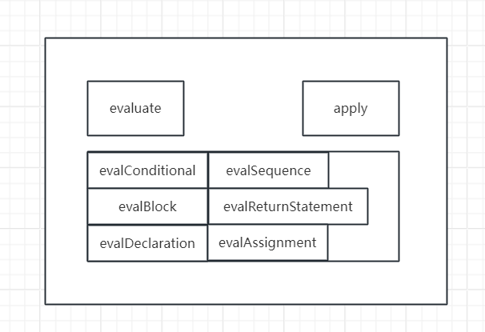

# evaluator 实现遇到的问题

1. 结构不是很清晰,抽象屏障的梳理不是很到位

2. 文件分模块的时候哪些属于底层，哪些属于高层没有很清晰的认识

3. 大型项目的组织缺乏适当的组织方法原则,除了将模块分文件来写之外，是否还有其他组织原则?

    

4. 这个项目中有一个很关键的概念叫做symbol, 这个是由makeName构造的,在赋值，定义变量，常量和函数的时候name需要使用makeName构造,取出来的时候要选择具体的值
